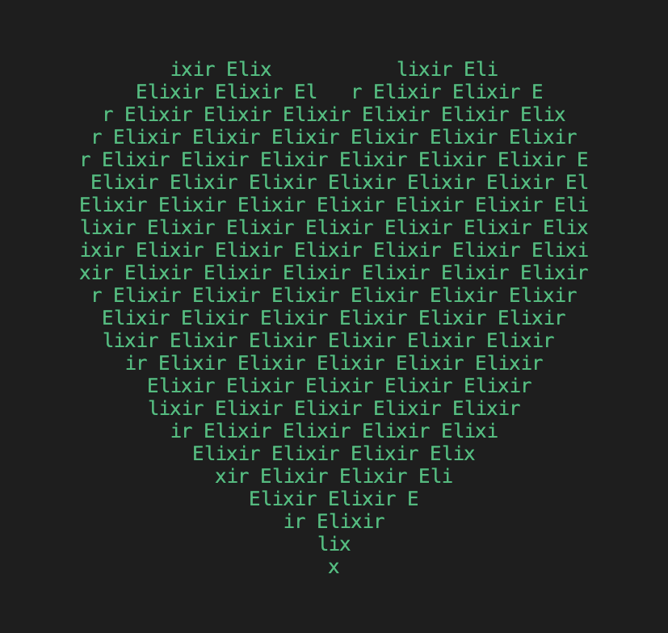
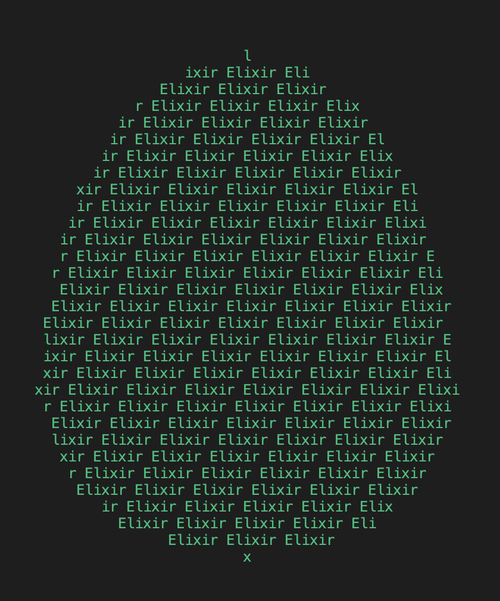

# Elixir goes ASCII Art ¯\\_(ツ)_/¯

This is a repo to play around with ASCII and elixir.

The aim is to create different patterns in your terminal that are made up of characters from a given string, in our case _Elixir_.

## The heart shape



### How to run

1. Clone the repo.
2. In your terminal, run:

```zsh
elixir we_love.exs
```

3. Enjoy playing around with it 😃

## Breakdown of the code

 The definition of the module `WeLove` contains the module attribute `love`, and the functions `character_at`, `math_power`, and `patch_together`.

 The code is split into 5 parts:

1. The module attribute `love` stores the string "Elixir ", chopped into its chars. (… of course, you can change the value to whatever you want, however, paying homage to our beloved Elixir lang seemed kinda fitting to start with 🙃)

2. The function `character_at` calculates the index of the character in the @love string using the modulo operator (which returns the remainder of the division of its first argument by its second argument) and the length of the string.

3. The function `math_power` takes two arguments, x and y, and returns a boolean, indicating whether the point (x, y) is inside the heart shape or not.

* This is the basic mathematical formula for our heart: ((x)² + (y)^2 - 1)³ - (x)² * (y)³ <= 0
* The ((x)² + (y)² - 1)³ part describes a circle, the (x)² * (y)³ part descibes a cube.
* Subtract the (x)² * (y)³ part from the ((x)² + (y)² - 1)³ part and less-than-or-equal it to 0 to get the shape of a heart.
* To play around with this math part, visit: <https://www.wolframalpha.com/input?i=++%28%28x+*+0.05%29%5E2+%2B+%28y+*+0.1%29%5E2+-+1%29%5E3+-+%28x+*+0.05%29%5E2+*+%28y+*+0.1%29%5E3+%3C%3D+0>

4. The function `patch_together` is the main function that creates the heart shape. It does so by:

* maps over a range of y values, and for each y value, again maps over a range of x values in order to create a row of characters for that specific y value.

* joins the characters in each of those rows to form a string.

* reverses the order of all the rows to make the heart point upwards.

* joins all the rows with a newline character to form the complete heart shape.

5. The last section of the code calls the `patch_together` function and prints the result to the terminal.

## The easter egg



### How to run

1. Clone the repo.
2. In your terminal, run:

```zsh
elixir easter_egg.exs
```

3. Enjoy playing around with it 😃

## Breakdown of the code

 The definition of the module `EasterEgg` contains the module attribute `egg`, and the functions `character_at`,  `math_power`, and `patch_together`.

 The code is split into 5 parts:

1. The module attribute `egg` stores the string "Elixir ", chopped into its chars. (… of course, you can change the value to whatever you want, however, paying homage to our beloved Elixir lang seemed kinda fitting to start with 🙃)

2. The function `character_at` calculates the index of the character in the @egg string using the modulo operator (which returns the remainder of the division of its first argument by its second argument) and the length of the string.

3. The function `math_power` takes two arguments, x and y, and returns a boolean, indicating whether the point (x, y) is inside the egg shape or not.

*  It's based on the mathematical formula for an ellipse x²/b² + y²/a² = 1
* We stitch together two ellipses to form an egg shape, depending on whether y > 0. For values meeting that condition, the shape gets broader, and for values not meeting that condition, the shape gets narrower.

* To play around with this math part, visit: <https://www.wolframalpha.com/input?i=%28y%2F2.5%29²+%2B+%28x%2F2%29²+%3D+1>

4. The function `patch_together` is the main function that creates the egg shape. It does so by:

* maps over a range of y values, and for each y value, again maps over a range of x values in order to create a row of characters for that specific y value.

* joins the characters in each of those rows to form a string.

* reverses the order of all the rows to make the egg point upwards.

* joins all the rows with a newline character to form the complete egg shape.

5. The last section of the code calls the `patch_together` function and prints the result to the terminal.
